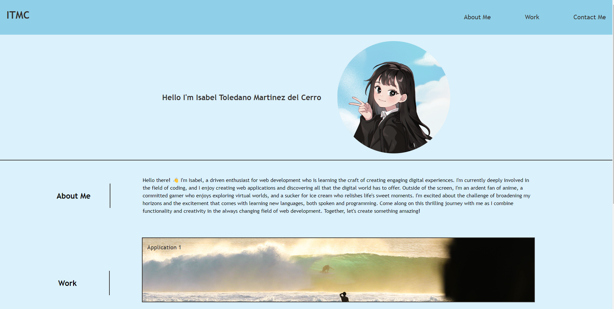
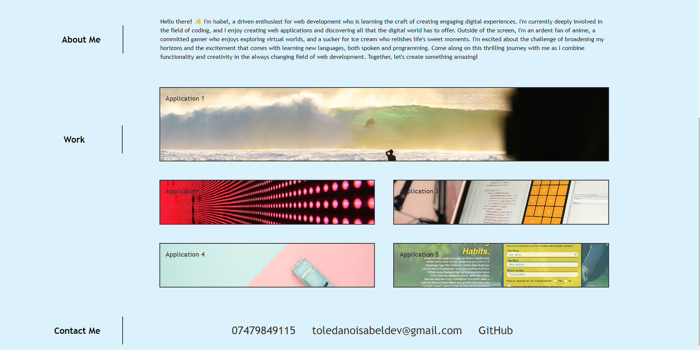

# Portfolio

## Description

Here is my portfolio, please enjoy! This project showcases my projects in a single space. Check out my work, read about me, and get in contact. I hope you discover anything that piques your curiosity, whether you're looking for a job, collaborating with someone, or you're just interested.

## Usage

    

    

## Credits

https://www.w3schools.com/howto/howto_js_topnav.asp
https://www.w3schools.com/css/css_navbar.asp
https://developer.mozilla.org/en-US/docs/Web/HTML/Element/link
https://www.w3schools.com/css/css_boxmodel.asp
https://developer.mozilla.org/en-US/docs/Learn/CSS/Building_blocks/The_box_model
https://www.w3schools.com/howto/howto_css_style_header.asp
https://css-tricks.com/snippets/css/a-guide-to-flexbox/
https://www2.cs.sfu.ca/CourseCentral/165/common/study-guide/content/css2-positioning.html#:~:text=The%20easiest%20way%20to%20move,up%2C%20and%20flow%20around%20it.
https://forum.freecodecamp.org/t/flexbox-position-of-h-element-within-div/611461
https://www.w3schools.com/cssref/pr_class_float.php
https://www.w3schools.com/cssref/pr_class_display.php
https://excalidraw.com/
https://css-tricks.com/snippets/css/complete-guide-grid/
https://www.joshwcomeau.com/css/interactive-guide-to-grid/

